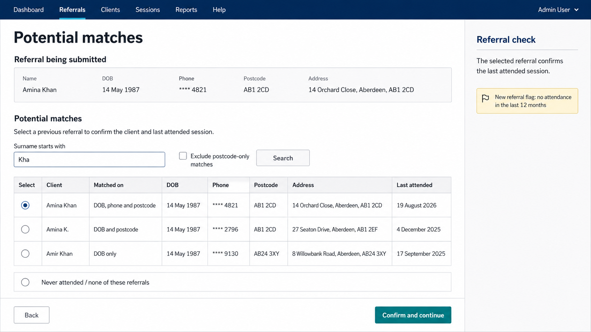

# Planning references

## Stock handling changes

[`stock-handling-changes.md`](./stock-handling-changes.md) records an exploratory planning
conversation about splitting stock takes by grouping, a crate mechanism for commingled shelf stock,
packing units, and a fresh-food shopping policy resolving server Q43. Nothing in it is a settled
requirement — it exists to prepare for a charity conversation, not to replace one.

## Potential matches attendance confirmation

This approved planning mock-up records the intended direction for the existing potential-matches step: show the incoming referral's date of birth, phone number, postcode and address; show the same details, address, last-attended date and `Matched on` criteria for each prior referral; support surname-prefix search and excluding postcode-only matches; and have the administrator select the applicable prior referral or `Never attended`.

It is a planning reference only, not an implemented screen specification or product asset.
