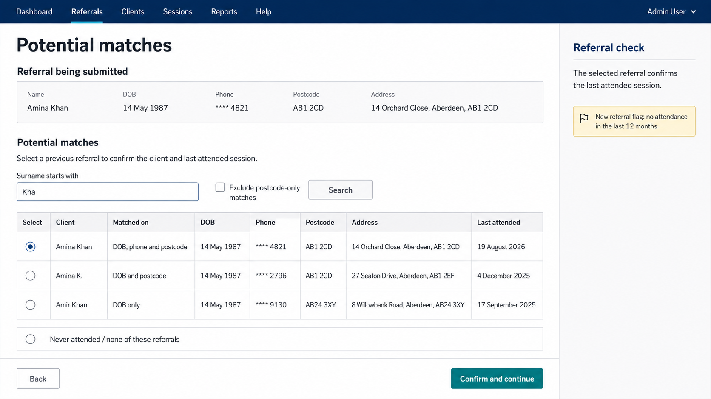

# Planning references

## Stock handling changes

[`stock-handling-changes.md`](./stock-handling-changes.md) records an exploratory planning
conversation about splitting stock takes by grouping, a crate mechanism for commingled shelf stock,
packing units, and a fresh-food shopping policy resolving server Q43. Nothing in it is a settled
requirement — it exists to prepare for a charity conversation, not to replace one.

[`stock-handling-implementation-plan.md`](./stock-handling-implementation-plan.md) is the build plan
for the groupings/crates/packing-units part of the above (§1–§3 only — the fresh shopping policy
stays excluded, blocked on server Q43), once that direction is agreed. Written to be handed to
another engineer or agent without needing this conversation's context.

[`stock-handling-server-handoff.md`](./stock-handling-server-handoff.md) turns the agreed branch
build direction into an ordered server workstream, including migration/backfill, contract and test
requirements. Its explicitly marked contract choices must be settled before the generated client
implementation can be wired to a real API.

## Versioned configuration releases

[`versioned-configuration-releases.md`](./versioned-configuration-releases.md) is the agreed
direction for moving the referral questionnaire and preference rules from client-bundled JSON to
immutable, server-stored releases keyed by `formId`, while the client stays the sole
validator/evaluator. It includes the generated-release manifest that proves the questionnaire and
rules JSON were generated together before upload.

[`versioned-configuration-releases-server-handoff.md`](./versioned-configuration-releases-server-handoff.md)
turns that plan into an ordered `foodbankserver` workstream — migrations, the API contract, and the
contract points that still need an explicit settle before they are built.

[`versioned-configuration-releases-server-handoff-addendum-1.md`](./versioned-configuration-releases-server-handoff-addendum-1.md)
supersedes that handoff's guidance on copying a referral: instead of silently reinterpreting an old
referral's answers under today's rules, a copy whose form has since changed opens a review of today's
form instead of creating anything.

[`versioned-configuration-releases-server-handoff-addendum-2.md`](./versioned-configuration-releases-server-handoff-addendum-2.md)
settles that `formId` never becomes required on a public referral submission — a missing value always
means the currently active release, permanently, not just for a bounded compatibility window.

## Potential matches attendance confirmation

This approved planning mock-up records the intended direction for the existing potential-matches step: show the incoming referral's date of birth, phone number, postcode and address; show the same details, address, last-attended date and `Matched on` criteria for each prior referral; support surname-prefix search and excluding postcode-only matches; and have the administrator select the applicable prior referral or `Never attended`.

It is a planning reference only, not an implemented screen specification or product asset.
